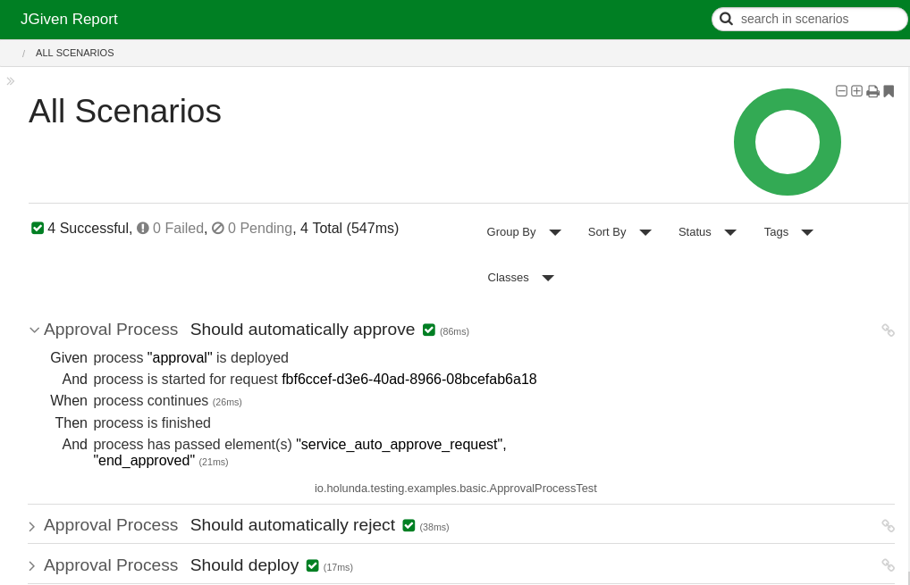

# Camunda BPM JGiven
Camunda specific stages and scenarios for the BDD testing tool JGiven written in Kotlin.

[](https://github.com/holisticon#open-source-lifecycle)
[]([https://github.com/holisticon#open-source-lifecycle](https://docs.camunda.org/manual/7.22/))
[](https://github.com/holunda-io/camunda-bpm-jgiven/workflows) 
[](https://maven-badges.herokuapp.com/maven-central/io.holunda.testing/camunda-bpm-jgiven)
[](https://www.openhub.net/p/camunda-bpm-jgiven)


# Relocation

This project is **relocated** to https://github.com/holunda-io/c7 and **will be developed** further there.
Last release produced from this location was **2025.05.1**
This repository will be archived.

## Motivation

Starting from 2012, we are preaching that processes are no units. Behavior-driven development (BDD) and the
underlying testing methodology of scenario-based testing is a way more adequate and convenient for writing
process (model) tests. 

Our first attempts addressed testing frameworks Cucumber and JBehave. For JBehave we were able to release
an official [Camunda BPM extension](https://github.com/camunda/camunda-bpm-jbehave), but it turned out that the main problem
in using it, was error-prone writing of the test specifications in Gherkin (text files) and glue code them with Java.

This is, where [JGiven](http://jgiven.org/) comes on the scene, allowing to write both in Java or any other JVM language
by providing a nice API and later generating reports which are human-readable.

## Usage

Add the following dependency to your Maven pom:

```xml
<dependency>
  <groupId>io.holunda.testing</groupId>
  <artifactId>camunda-bpm-jgiven</artifactId>
  <version>1.22.0</version>
  <scope>test</scope>
</dependency>
```
## Features

JGiven supports separation of the glue code (application driver) into so-called [stages](http://jgiven.org/userguide/#_stages_and_state_sharing).
Stages contain assert and action methods and may be subclassed. This library provides a base class
`ProcessStage` for building your process testing stages. Here is how the test then looks like
(written in Kotlin):

### JUnit5

```kotlin
@Deployment(resources = [ApprovalProcessBean.RESOURCE])
internal class ApprovalProcessTest :
  ScenarioTest<ApprovalProcessActionStage, ApprovalProcessActionStage, ApprovalProcessThenStage>() {

    @RegisterExtension
    val extension = TestProcessEngine.DEFAULT

    @ScenarioState
    val camunda = extension.processEngine

    @Test
    fun`should automatically approve`() {

        val approvalRequestId = UUID.randomUUID().toString()

        GIVEN
            .process_is_deployed(ApprovalProcessBean.KEY)
            .AND
            .process_is_started_for_request(approvalRequestId)
            .AND
            .approval_strategy_can_be_applied(Expressions.ApprovalStrategy.AUTOMATIC)
            .AND
            .automatic_approval_returns(Expressions.ApprovalDecision.APPROVE)

        WHEN
            .process_continues()

        THEN
            .process_is_finished()
            .AND
            .process_has_passed(Elements.SERVICE_AUTO_APPROVE, Elements.END_APPROVED)

    }
}
```

Here is the corresponding stage, providing the steps used in the test:

```kotlin
class ApprovalProcessActionStage : ProcessStage<ApprovalProcessActionStage, ApprovalProcessBean>() {

  @BeforeStage
  fun `automock all delegates`() {
    CamundaMockito.registerJavaDelegateMock(DETERMINE_APPROVAL_STRATEGY)
    CamundaMockito.registerJavaDelegateMock(AUTOMATICALLY_APPROVE_REQUEST)
    CamundaMockito.registerJavaDelegateMock(ApprovalProcessBean.Expressions.LOAD_APPROVAL_REQUEST)
  }

  fun process_is_started_for_request(approvalRequestId: String) = step {
    processInstanceSupplier = ApprovalProcessBean(camunda.processEngine)
    processInstanceSupplier.start(approvalRequestId)
    assertThat(processInstanceSupplier.processInstance).isNotNull
    assertThat(processInstanceSupplier.processInstance).isStarted
  }

  fun approval_strategy_can_be_applied(approvalStrategy: String) = step {
    getJavaDelegateMock(DETERMINE_APPROVAL_STRATEGY).onExecutionSetVariables(Variables.putValue(APPROVAL_STRATEGY, approvalStrategy))
  }

  fun automatic_approval_returns(approvalDecision: String) = step {
    getJavaDelegateMock(AUTOMATICALLY_APPROVE_REQUEST).onExecutionSetVariables(Variables.putValue(APPROVAL_DECISION, approvalDecision))
  }
}
```

### JUnit4

```kotlin
@Deployment(resources = [ApprovalProcessBean.RESOURCE])
open class ApprovalProcessTest : ScenarioTest<ApprovalProcessActionStage, ApprovalProcessActionStage, ApprovalProcessThenStage>() {

    @get: Rule 
    val rule: ProcessEngineRule = StandaloneInMemoryTestConfiguration().rule()

    @ScenarioState
    val camunda = rule.processEngine

    @Test
    fun`should automatically approve`() {

        val approvalRequestId = UUID.randomUUID().toString()

        GIVEN
            .process_is_deployed(ApprovalProcessBean.KEY)
            .AND
            .process_is_started_for_request(approvalRequestId)
            .AND
            .approval_strategy_can_be_applied(Expressions.ApprovalStrategy.AUTOMATIC)
            .AND
            .automatic_approval_returns(Expressions.ApprovalDecision.APPROVE)

        WHEN
            .process_continues()

        THEN
            .process_is_finished()
            .AND
            .process_has_passed(Elements.SERVICE_AUTO_APPROVE, Elements.END_APPROVED)

    }
}
```

If you want to collect process test coverage during the test run, make sure to replace your rule declaration by the following: 

```kotlin
  companion object {
  @get: ClassRule
  @JvmStatic
  val processEngineRule: ProcessEngineRule = TestCoverageProcessEngineRuleBuilder.create().build()
}

@get:Rule
val rule: ProcessEngineRule = processEngineRule

```

and add the following content into your `camunda.cfg.xml`:

```xml
<?xml version="1.0" encoding="UTF-8"?>

<beans xmlns="http://www.springframework.org/schema/beans"
       xmlns:xsi="http://www.w3.org/2001/XMLSchema-instance"
       xsi:schemaLocation="http://www.springframework.org/schema/beans   http://www.springframework.org/schema/beans/spring-beans.xsd">

  <bean id="processEngineConfiguration"
        class="org.camunda.community.process_test_coverage.engine.platform7.ProcessCoverageInMemProcessEngineConfiguration">
    <property name="history" value="full"/>
  </bean>
</beans>
```


The resulting report:




Interested? Check out the examples.

## License

This library is developed under

[](/LICENSE)


## Contribution

We use gitflow for development. If you want to contribute, start and create
an issue. Then fork the repository, create a feature branch and provide a 
pull-request against `develop`.

If you have permissions to release, make sure all branches are fetched and run: 

     ./mvnw gitflow:release-start 
     ./mvnw gitflow:release-finish
     
from cli. This will update the poms of `develop` and `master` branches 
and start GitHub actions producing a new release.

